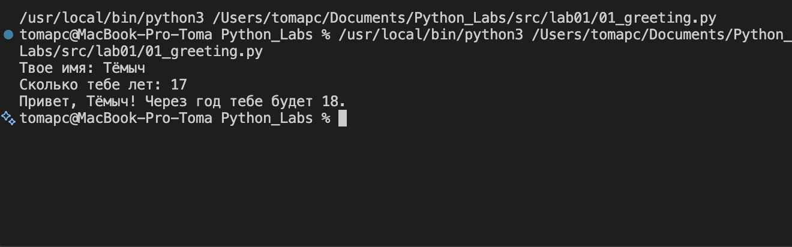
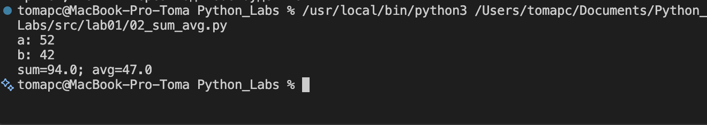
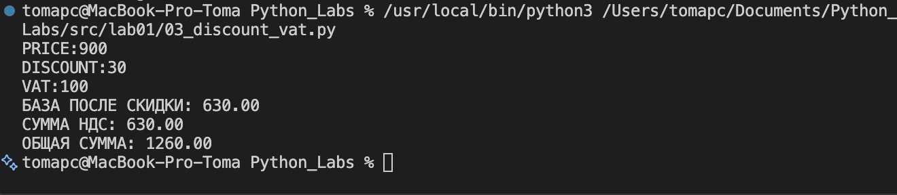
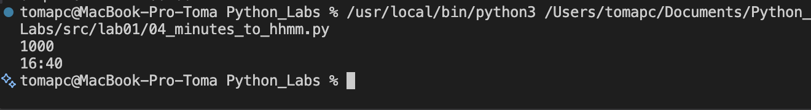
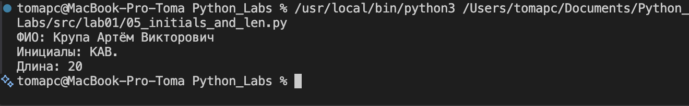
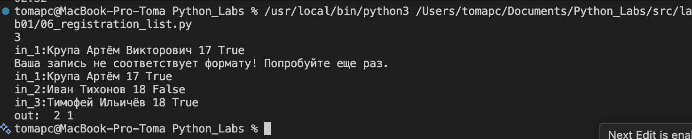
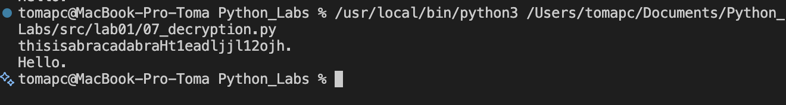

# Лабораторные работы по Python

Репозиторий с лабораторными работами. Исходный код находится в [src/](src/), скриншоты выполнения программ — в [images/](images/).

---

## Лабораторная работа №1

### 1. Приветствие — [01_greeting.py](src/lab01/01_greeting.py)

Программа запрашивает имя и возраст пользователя, после чего выводит приветствие и сообщает, сколько лет ему исполнится через год.

**Как работает код:** имя читается через `input()` как строка, возраст приводится к целому числу с помощью `int()`. Результат выводится f-строкой, в которой прямо в выражении вычисляется `age+1`.

---

### 2. Сумма и среднее — [02_sum_avg.py](src/lab01/02_sum_avg.py)

Программа считывает два вещественных числа и выводит их сумму и среднее арифметическое.

**Как работает код:** оба числа читаются через `input()` и преобразуются в `float`, чтобы работать с дробными значениями. В f-строке вычисляются сумма `a+b` и среднее `(a+b)/2`.

---

### 3. Скидка и НДС — [03_discount_vat.py](src/lab01/03_discount_vat.py)

Программа рассчитывает итоговую стоимость товара: сначала применяется скидка, затем на полученную базу начисляется НДС.

**Как работает код:** на вход подаются цена, процент скидки и процент НДС. База считается как `price*(1-discount/100)`, сумма НДС — как `base*vat/100`, итог — их сумма. Все три значения выводятся с округлением до двух знаков через спецификатор формата `:.2f`.

---

### 4. Минуты в часы:минуты — [04_minutes_to_hhmm.py](src/lab01/04_minutes_to_hhmm.py)

Программа переводит количество минут в формат `ЧЧ:ММ`.

**Как работает код:** целочисленное деление `min//60` даёт часы, остаток от деления `min%60` — минуты. Спецификатор `:02d` применяется к обеим частям и дополняет их ведущим нулём, поэтому и часы, и минуты всегда выводятся двузначными.

---

### 5. Инициалы и длина ФИО — [05_initials_and_len.py](src/lab01/05_initials_and_len.py)

Программа принимает ФИО и выводит инициалы, а также суммарное количество букв.

**Как работает код:** строка разбивается по пробелам методом `split()` на три части, которые распаковываются в переменные `n1, n2, n3`. Из каждой берётся первый символ и переводится в верхний регистр через `upper()`. Длина считается как сумма `len()` трёх частей — пробелы при этом не учитываются.

---

### 6. Список регистраций — [06_registration_list.py](src/lab01/06_registration_list.py)

Программа считывает `n` корректных записей о регистрации и подсчитывает, сколько из них со статусом `True`, а сколько — с `False`.

**Как работает код:** цикл `while` работает, пока не набрано `n` валидных записей. Каждая строка проверяется на соответствие формату: первые два поля должны быть буквенными (`isalpha()`), третье — числом (`isdigit()`). Счётчик `i` увеличивается только при успешной проверке, поэтому некорректная запись не засчитывается и запрашивается заново. Приглашение ко вводу нумеруется (`in_1:`, `in_2:`, ...), а в конце выводятся счётчики `t` и `f` с префиксом `out:`.

---

### 7. Расшифровка сообщения — [07_decryption.py](src/lab01/07_decryption.py)

Программа извлекает скрытое сообщение из зашумлённой строки.

**Как работает код:** сначала два цикла находят позицию первой заглавной буквы (`n1`) и позицию первой цифры (`n2`). Разница `m = n2 - n1` задаёт шаг выборки символов. Далее строка обходится начиная с `n1`, и каждый символ, индекс которого кратен `m+1`, добавляется к результату. Обход прерывается при встрече точки — она отмечает конец сообщения.

